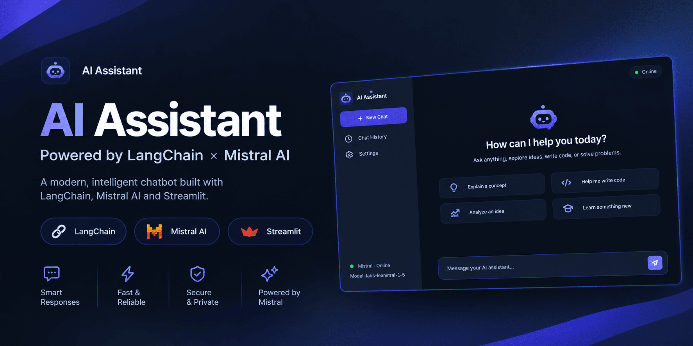

# AI Assistant

<p align="center">
  
</p>

# Generative AI & LangChain Learning Journey

A practical repository built while learning **Generative AI**, **LangChain**, and **LLM Integrations**. This repository contains hands-on scripts ranging from basic chat models and embeddings to a full-featured Streamlit chatbot UI.

---

##  Topics Covered & Curriculum Roadmap

- **LLM & Chat Model Foundations**: Interacting with API-based LLMs using LangChain.
- **Environment & Setup**: Virtual environment creation, `.env` management, and dependencies.
- **Provider Integrations**: Working with API keys for Mistral AI, OpenAI, and Hugging Face.
- **Local AI Models**: Running open-source models on local hardware.
- **Embedding Models**: Generating vector representations for text semantic search.
- **Stateful Conversational Chatbots**: Managing chat history using `SystemMessage`, `HumanMessage`, and `AIMessage`.
- **UI Chatbot Application**: Interactive web application using Streamlit and custom CSS styling.

---

##  Repository Structure

```text
Gen Ai/
├── chatmodels/
│   ├── chat.py             # Basic chat model integration
│   ├── chatbot.py          # Terminal-based conversational chatbot
│   ├── huggingface.py      # Hugging Face inference integration
│   ├── localmodel.py       # Local AI model execution
│   └── UIchatbot.py        # Streamlit web app UI for chatbot
├── embeddingmodels/
│   ├── embeddings.py       # Text embedding generation
│   └── huggingface_embeddings.py  # Hugging Face embedding pipelines
├── src/gen_ai/             # Modular package source files
├── .env                    # Environment variables (API keys - gitignored)
├── .gitignore              # Files excluded from version control
├── pyproject.toml          # Project configuration & metadata
├── requirements.txt        # Python package dependencies
└── README.md               # Repository documentation